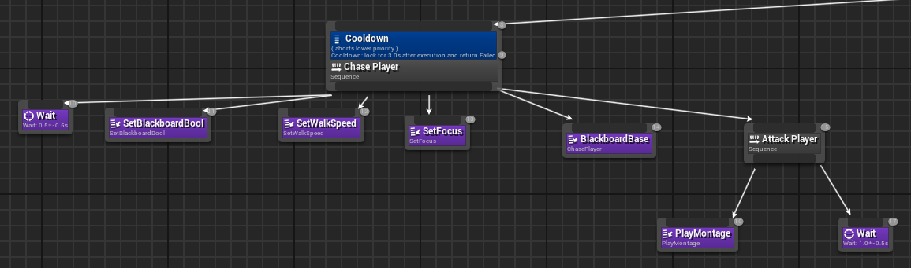
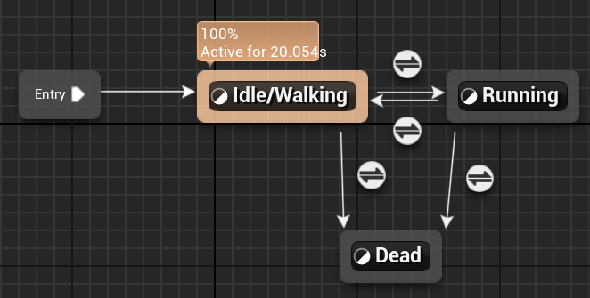
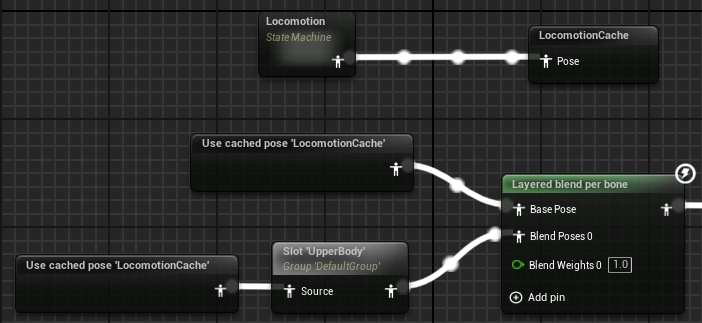

Check out **Terminal's**
- 🕹️ [**Game Page**](https://henryha993.itch.io/terminal)
- 💾 [**Project Files**](https://github.com/HenryHa993/MBShooter)

## About
Terminal is a horror shooter made using **C++** and **UE5**. This project contains 4 *unique* enemies, which undergo different animations and AI.

This is a personal remake of a group project made during my time at [The Developer Academy's](https://thedeveloperacademy.com/) Unreal Engine 5 bootcamp. Big thanks to [Clayton Rist](https://www.linkedin.com/in/clayton-rist-027185171/?originalSubdomain=uk) who contributed with the original level construction, playtesting and the blaster sound.

This project was initially a zombie shooter with bare-bones AI and animation implementation. Upon revisit, I wanted to improve on those fronts and develop behaviours which take advantage of **layered animations** and Unreal Engine's **EQS**.

Most of these components are done using C++ and may be documented further in the **Related Posts** section.

## Techniques
The primary focus of this project was to incorporate some varied behaviours into a complete game. Below you can see some of the techniques used to achieve the gameplay and enemies you see in Terminal.

### C++
1. **C++ Anim Notifiers**
    - Used to check player range and apply damage on a specific frame of attack animations.
```cpp
void UAnimNotify_AttackPlayer::Notify(USkeletalMeshComponent* MeshComp, UAnimSequenceBase* Animation)
{
    Super::Notify(MeshComp, Animation);

    if (!(MeshComp))
    {
        UE_LOG(LogTemp, Warning, TEXT("PlayerController or MeshComponent NULL"));
        return;
    }

    APlayerController* PlayerController = GetWorld()->GetFirstPlayerController();
    AMB2Character* PlayerCharacter = Cast<AMB2Character>(PlayerController->GetPawn());

    AActor* AIActor = MeshComp->GetOwner();

    FVector AILocation = AIActor->GetActorLocation();
    FVector PlayerLocation = PlayerCharacter->GetActorLocation();

    float Distance = FVector::Distance(AILocation, PlayerLocation);

    if(Distance <= AttackRange)
    {
        UGameplayStatics::ApplyDamage(PlayerCharacter, Damage, PlayerController, AIActor, DamageType);
        UE_LOG(LogTemp, Warning, TEXT("Hit, Health: %f"), PlayerCharacter->HealthComponent->GetHealth());
    }
}
```
2. **C++ HealthComponent**
    - Had the health as a separate `ActorComponent` class.
    - This is a huge improvement of how I used to do it (in the `Character` classes) and is great in terms of modularity.
3. **C++ Delegates**
    - Used to trigger **behaviour trees** when specific stages are reached.
    - This ensures behaviour trees aren't ticking for enemies which are behind doors which aren't open.
```cpp
    void AMB2GameState::IncrementGameStage()
    {
        GameStage++;
        OnGameStageChangedDelegate.Broadcast(GameStage);

        // Check if game won
        if(GameStage >= 4)
        {
            if (!GameEndWidget)
            {
                return;
            }

            if(UUserWidget* GameEndScreen = CreateWidget(GetWorld(), GameEndWidget))
            {
                GameEndScreen->AddToViewport();
            }
        }
    }
```
4. **C++ Gameplay Timers**
    - This was used to add a delay between rounds.
    - This is more of a feel-good thing, didn't want rounds to be sudden and disorient the player due to the camera panning.
```cpp
// This is called each time an alien dies
void AMB2GameState::CheckStageComplete()
{
    TArray<AActor*> AlienActors;
    UGameplayStatics::GetAllActorsOfClass(GetWorld(), ABaseAlienCharacter::StaticClass(), AlienActors);

    // Check if any aliens alive for given stage
    for(AActor* Actor : AlienActors)
    {
        ABaseAlienCharacter* AlienCharacter = Cast<ABaseAlienCharacter>(Actor);

        if((AlienCharacter->Stage == GameStage) && (!AlienCharacter->IsDead))
        {
            return;
        }
    }

    // Otherwise, they are all dead and the next stage should pursue
    GetWorld()->GetTimerManager().SetTimer(
        StageTimerManager,
        this,
        &AMB2GameState::IncrementGameStage,
        StageChangeDuration,
        false);
}
```
5. **C++ Camera Lock On**
    - For clarity, I used a camera lock-on technique to alert the player of what door/stage was being unlocked.
    - This C++ function is called in **blueprints** for the opening duration.
```cpp
void UAnimNotify_AttackPlayer::Notify(USkeletalMeshComponent* MeshComp, UAnimSequenceBase* Animation)
{
    Super::Notify(MeshComp, Animation);

    if (!(MeshComp))
    {
        UE_LOG(LogTemp, Warning, TEXT("PlayerController or MeshComponent NULL"));
        return;
    }

    APlayerController* PlayerController = GetWorld()->GetFirstPlayerController();
    AMB2Character* PlayerCharacter = Cast<AMB2Character>(PlayerController->GetPawn());

    AActor* AIActor = MeshComp->GetOwner();

    FVector AILocation = AIActor->GetActorLocation();
    FVector PlayerLocation = PlayerCharacter->GetActorLocation();

    float Distance = FVector::Distance(AILocation, PlayerLocation);

    if(Distance <= AttackRange)
    {
        UGameplayStatics::ApplyDamage(PlayerCharacter, Damage, PlayerController, AIActor, DamageType);
        UE_LOG(LogTemp, Warning, TEXT("Hit, Health: %f"), PlayerCharacter->HealthComponent->GetHealth());
    }
}
```
6. **Parry**
    - One of the enemies has a charging attack which can be interrupted if it is hit while it charges.
    - This is mainly done with the **behaviour tree** and in the **C++** where the alien updates whether it was hit in a given frame. I thought it was cool.

### Blueprints
1. **Event Dispatchers**
    - Door functionality was done in **blueprints**, so a matching event was created to listen to `MB2GameState`'s broadcast of the `OnGameStateChanged` delegate.
2. **UI**
    - Mostly done in **blueprints**, but handled in the `MB2GameState` **C++** class.

### Artificial Intelligence
1. **Behaviour Trees**
    - **Tasks** and **services** done in **C++**.
    - Below is a charge attack sequence.



2. **Environment Query System**
    - Used to calculate locations for the hiding and strafing behaviours.
    - Incorporated into behaviour trees.

### Animation Programming
1. **Animation Blueprints**
    - **State Machines** used to switch between **blendspaces**.
    - **Event Graphs** done in **blueprints** in order to update variables used in the **state machines**.



2. **Layered Animations**
    - Blended animations by bone in order to create more natural movements and attacks.



5. **Blendspaces**
    - Blending of movement animations by direction and speed.

### Sounds
1. **Metasounds**
    - I added footsteps with random pitch variation.
    - This is done so players can hear enemies that haven't been killed (mainly the hiding ones).

### Version Control
1. **Perforce**

## Related Posts