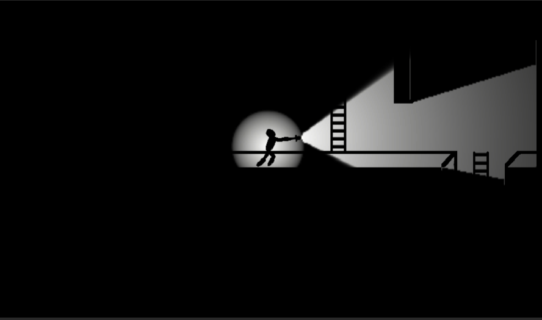

Check out the **Library's**
- 💾 [**Project Files**](https://github.com/HenryHa993/EscapeGhoulPrison)
- 📃 [**Dissertation**](/PALibraryDissertation.pdf)

## About
This procedural animation library was done for final year dissertation at Warwick University. The goal was to create a library which abstracted and refined the process of coding new **procedural animations** within **Unity**.

Procedural animations rely on programmed calculations each frame to create reactive and natural movements. This was combines with a basic **behaviour trees** and an **A\* pathfinding algorithm** to display such animations.

## Techniques
This was a great learning experience, which allowed me to develop my knowledge of game
development and tool creation.

Here are some of the tools and techniques I used:

### C#
1. **A\* Pathfinding Algorithm**
    - Implemented a pathfinding algorithm alongside a **grid manager** using **C#**.
    - The **grid manager** is used to discern whether specific tiles were traversable or not.
    
        See [`Assets/PA Library/APathfinding`](https://github.com/HenryHa993/Project-AC/tree/main/Assets/PA%20Library/APathfinding)
        
2. **Procedural Animation Library**
    - Created a library to manage the creation and application of procedural animations of limbs.
    - Allows users to apply different target selection rules onto different limbs, all managed under a `MotionDirector` object.
    
        See [`Assets/PA Library`](https://github.com/HenryHa993/Project-AC/tree/main/Assets/PA%20Library)

3. **C# Delegates**
    - Used to decouple animation targets from the `MotionDirector`.
    
        See [`Assets/PA Library/MotionDirector.cs`](https://github.com/HenryHa993/Project-AC/blob/main/Assets/PA%20Library/MotionDirector.cs)

### Artificial Intelligence
1. **Behaviour Trees**
    - I used [**PadaOne's Behaviour Bricks**](https://bb.padaonegames.com/) in order to create the basic enemy behaviour tree in the sample.
    - The behaviour tree **tasks** were built using **C#**.
    
        See [`Assets/Scripts/Entity/Actions`](https://github.com/HenryHa993/Project-AC/tree/main/Assets/Scripts/Entity/Actions)

2. **A\* Pathfinding Algorithm**
    - Used to find the shortest path to navigate 2D environments.
    - Combined with behaviour tree tasks/actions.
    
        See [`Assets/PA Library/APathfinding`](https://github.com/HenryHa993/Project-AC/tree/main/Assets/PA%20Library/APathfinding)

### Version Control
1. **GitHub**

## Related Posts